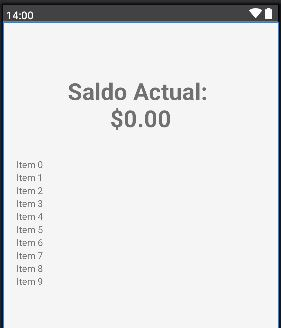
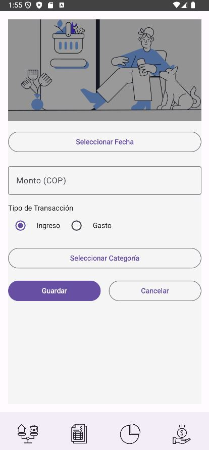

# Aplicación Android

Desarrollar una aplicación de finanzas personales para dispositivos Android utilizando Kotlin como lenguaje de programación. La aplicación gestiona transacciones financieras localmente y permite al usuario llevar el control de sus ingresos, gastos y balance a través de una interfaz intuitiva.

## Funcionalidades de la aplicación

## Restricciones técnicas
1. Esta aplicación funcionará en dispositivos Android con sistema operativo versión 5 o superior.
2. Los datos financieros se gestionan localmente dentro de la aplicación, utilizando bases de datos locales como Room o archivos de almacenamiento interno.
3. Se solicitará al usuario permiso para acceder a almacenamiento interno, necesario para guardar y gestionar las transacciones de manera local.

## Funcionalidades de usuario
**MisFinanzas** permitirá al usuario gestionar y monitorear sus finanzas de forma sencilla. El usuario podrá:

- **Ingreso de transacciones**: El usuario puede registrar tanto ingresos como gastos, especificando montos, categorías y la fecha de la transacción. Los gastos se ingresan como valores positivos y la aplicación se encarga de restarlos del balance.
- **Visualización del saldo actual**: La aplicación muestra el balance actual basado en las transacciones ingresadas.
- **Historial de transacciones**: Permite al usuario revisar todas las transacciones anteriores con opciones para filtrarlas por fechas y categorías.
- **Gráficos financieros**: La aplicación proporciona gráficos para visualizar los patrones de gastos e ingresos a lo largo del tiempo.
- **Gestión de categorías**: El usuario puede crear y gestionar categorías personalizadas para organizar mejor sus finanzas.

## Diseño de interfaz de usuario:

La interfaz de usuario de la aplicación **MisFinanzas** está inspirada en el uso de **Material Design**. A continuación, se presentan las principales pantallas:

1. Pantalla de inicio

   

2. Pantalla principal

   

3. Agregar transacciones 

   

